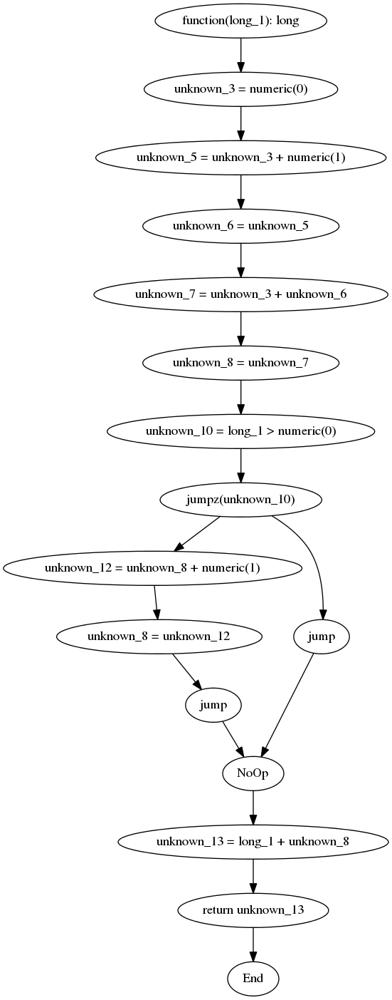
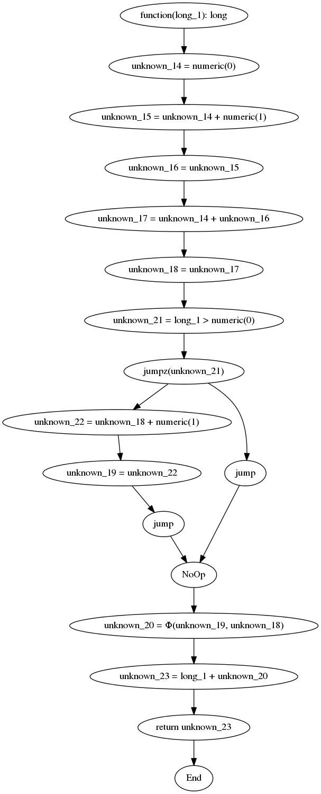
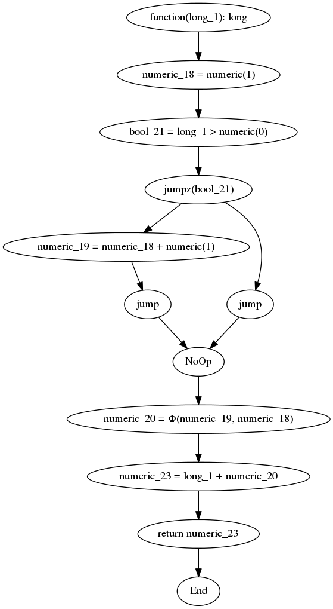
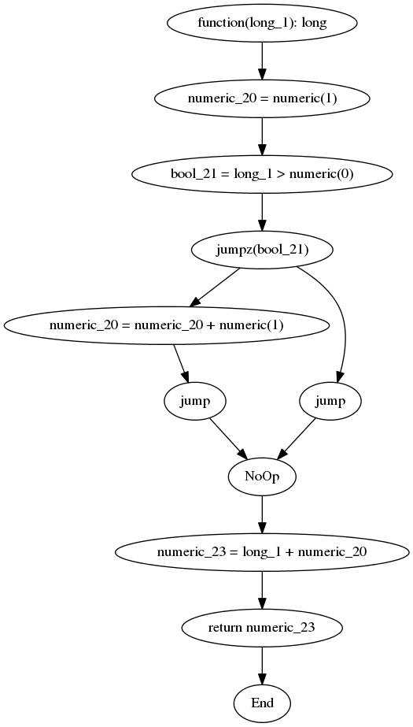

<!--
 * Copyright 2014 Google Inc. All rights reserved.
 *
 * Licensed under the Apache License, Version 2.0 (the "License");
 * you may not use this file except in compliance with the License.
 * You may obtain a copy of the License at
 *
 *     http://www.apache.org/licenses/LICENSE-2.0
 *
 * Unless required by applicable law or agreed to in writing, software
 * distributed under the License is distributed on an "AS IS" BASIS,
 * WITHOUT WARRANTIES OR CONDITIONS OF ANY KIND, either express or implied.
 * See the License for the specific language governing permissions and
 * limitations under the License.
 *
 * @copyright 2014 Google Inc. All rights reserved
 * @license http://www.apache.org/licenses/LICENSE-2.0.txt Apache-2.0
-->

Basic Operation
===============

The Recki-CT compiler uses a series of steps to transform PHP code into compiled code.

The following code-block will be used in some of the examples to illustrate the process:

    /**
     * @param int $n
     * @return int
     */
    function test($n)
    {
        $a = 0;
        $b = $a + 1;
        $c = $a + $b;
        if ($n > 0) {
            $c += 1;
        }
        return $n + $c;
    }

## Step 1: Parse PHP Code

Recki-CT uses the [PHP-Parser Project](https://github.com/nikic/PHP-Parser) by [@nikita_ppv](https://twitter.com/nikita_ppv) to convert PHP code
into an [Abstract Syntax Tree (AST)](http://en.wikipedia.org/wiki/Abstract_syntax_tree) representation.

## Step 2: Analyze/Transform AST

The generated AST is then analyzed and transformed through a series of operations. This happens in the `Analyzer` package, with individual
transformations residing in `Analyzer\AstProcessor`.

These include:

 * Resolving assignment-operators to separate operate-then-assign operations. 

    This reduces compiler complexity by reducing the number of operators it needs to support.

    For example:

        $a += $b

    Will be transformed into:

        $a = $a + $b

 * Removing Else-If statements, and replacing them with nested if/else statements.

    This reduces compiler complexity by reducing the number of operators it needs to support.

    For example:

        if ($a) {
            x();
        } elseif ($b) {
            y();
        } else {
            z();
        }

    Will be transformed into:

        if ($a) {
            $x();
        } else {
            if ($b) {
                y();
            } else {
                z();
            }
        }

 * Removing primitive loop structures.

    This reduces compiler complexity. Loops are replaced with goto/label and conditional goto instructions.

    For example:

        while ($a) {
            b();
        }

    Will be approximately transformed into:

        label_1:
        if (!$a) {
            goto label_2;
        }
        b();
        goto label_1;
        label_2:

 * Resolving Signatures Of Functions and Function Calls

    This annotates the AST with additional information that the compiler will need later on.

 * Determine Recursive Function Calls

    This annotates the AST with additional information that the compiler can use to make better optimizations.

 * Block References

    This will raise errors when variable references are encountered. They are not allowed by-design.

## Step 3: Convert the AST into a Graph

A [Control Flow Graph (CFG)](http://en.wikipedia.org/wiki/Control_flow_graph) is created from the AST, then the AST is discarded. 

This happens via a rule-based parser which resides in the `Parser` package.

The graph is represented using the [Gliph library](https://github.com/sdboyer/gliph) by [@sdboyer](https://twitter.com/sdboyer).

The vertices and variables are represented in the `Graph` package.

The example function from above (`test()`) will result in the following graph (printed by the `Util\GraphPrinter`, which uses [GraphViz](http://www.graphviz.org/) via the [phpDocumentor/GraphViz library](https://github.com/phpDocumentor/GraphViz) to generate the images):

## Step 4: Convert the CFG into SSA Form

Next, the CFG is processed using a Graph Processor to covert it into [Static Single Assignment Form (SSA)](http://en.wikipedia.org/wiki/Static_single_assignment_form).

This results in a graph where no variable is written to more than once. This increases the overall number of variables used, 
but also allows for code to be reasoned about easier.

This also introduces a new `Vertex` type: `Phi`. Since each variable can only be written to once, there needs to be a way of combining
writes from different branches. The "magic" Phi function does this.

For example (in pseudo code):

    a = 1
    if (b) {
        a = 2
    }
    return a

would become:

    a1 = 1
    if (b) {
        a2 = 2
    }
    a3 = phi(a1, a2)
    return a3

The exact way that the `Phi` vertex operates is beyond the scope of this document. But in general, it "picks" the appropriate variable, based on which branch was taken to get to it.

The example function from above (`test()`) would result in the following graph:

## Step 5: Determine Types and Optimize the CFG

The CFG then gets repeatedly run through a set of Optimizer Rules (which live in the `Analyzer\OptimizerRule` package).

The rules will attempt to determine the types of every single variable, and optimize away instructions if possible.

These include:

 * Copy types during assignment operations

    Since assignments only happen once, we know that the target variable will **always** have the same type as the input variable. So copy the type!

 * Resolve the type of basic operations

    If we know the types of inputs, we should be able to resolve the type of the output. For example, 1 + 2 is always a numeric output.

    This operates on most binary and unary operations.

 * Propagate Constants

    Since variables are only assigned once, assigning a constant to a variable can be optimized out (simply replace all occurrences of the variable by the constant).

    There is one catch to this though. If the variable being assigned to is used in a `Phi` function, then we can't optimize it away (yet).

 * Resolve Constant Operations

    Since we propagate constants, we can determine the result of constant operations at compile time.

    For example:

        a = 1 + 2

    Would become:

        a = 3

    This would then allow constant propagation to take it further.

 * Remove Dead Assignment Operations

    If an assignment operation occurs on a variable that's never used, then the assignment can be removed.

    For example:

        a = 3
        b = 4
        return a

    Would become (via this rule only):

        a = 3
        return a

And more

The example function from above (`test()`) would result in the following graph:

## Step 6: Resolve Same-Typed Phi Functions

The next operation is to compile out of SSA form, by resolving Phi functions which have the same type inputs. 

For example:

    a_string = phi(b_string, c_string)

Would replace all occurrences of `b_string` and `c_string` with `a_string` everywhere in the application.

Note that this happens only after **all** optimizations are finished. After this step, the CFG is no longer in SSA form, so the assumptions that are made in the optimizer won't hold up anymore.

The example function from above (`test()`) would result in the following graph:

The overall process if far more complicated, so there's a complete chapter on this topic: [Phi Resolving](5_phi_resolving.md)...

## Step 7: Generate IR

The CFG is then converted into an [Intermediary Representation](http://en.wikipedia.org/wiki/Intermediate_language), specifically using a custom form of [Three Address Code](http://en.wikipedia.org/wiki/Three_address_code).

This is represented as a string of instructions.

For example:

    function test($a) {
        return $a + 1;
    }

Could be represented as:

    function test long
    param $1 long
    begin
    const $2 numeric 1
    var $3 numeric
    + $1 $2 $3
    return $3
    end

The `+ $1 $2 $3` line is basically the same as writing `$3 = $1 + $2`.

Our `test()` example from above would be compiled into the following IR:

    function test long
    param $1 long
    begin
    const $2 numeric 1
    var $3 numeric
    assign $2 $3
    const $4 numeric 0
    var $5 bool
    > $1 $4 $5
    jumpz $5 @1
    const $6 numeric 1
    + $3 $6 $3
    label @1
    var $7 numeric
    + $1 $3 $7
    return $7
    end

## Step 8: Compile IR

The IR is the parsed by splitting on newline, then splitting on space (it's a simple format). The instructions are then issued into a compiler. The compiler will return a callable (PHP function) which can be called!

Currently, only a single compiler backend is supported: [JIT-Fu](https://github.com/krakjoe/jitfu) by [@krakjoe](https://twitter.com/krakjoe).

The toolkit is written in such a manner that generating new backends should be quite easy.

## Step 9: Execute!!!

That's it! The entire chain should hopefully result in you having an executable natively implemented function!!!
